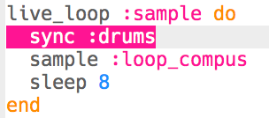

## إضافة عينة

دعونا نضيف عينة حلقة فوق حلقة الطبل الأساسية.

+ لتشغيل عينة في الوقت ذاته مع الطبول، قم بإنشاء `live_loop` يسمى `:sample`.
    
    

+ أضف العينة `:loop_compus`، مما يجعلها تلعب كل 8 ضربات.
    
    

+ إذا قمت باختبار العينة الخاصة بك، ستلاحظ أنها **لا تتطابق مع الطبول** على الإطلاق!
    
    

      <audio controls preload> <source src="resources/beat-bug.mp3" type="audio/mpeg"> المتصفح الخاص بك لا يدعم عنصر <code>الصوت </code>. </audio>
    

+ أول شيء ستحتاج إلى القيام به هو `مزامنة` العينة الخاصة بك مع ايقاع الطبلة.
    
    

+ هذا لا يزال غير صحيح! أضف الكود لطباعة مدة العينة:
    
    

+ إذا قمت بالرجوع للخلف عبر سجل ** log ** ، سترى أنه على الرغم من أن العينة تكرر كل 8 نبضات ، ** فانها لا تستمر 8 نبضات **.
    
    
    
    (يمكنك الآن إزالة الرمز لطباعة مدة العينة.)

+ لمطابقة عينتك مع الطبول ، ستحتاج إلى تمديد ** stretch ** العينة بحيث تستمر 8 نبضات بالضبط.
    
    

+ اختبر الرمز بالضغط على تشغيل "Run" مرة أخرى - ** لست بحاجة إلى إيقاف الموسيقى وإعادة تشغيلها **! يجب أن تسمع الآن أن عينتك تشتغل في الوقت ذاته مع إيقاع الطبل الخاص بك.
    
    

      <audio controls preload> <source src="resources/beat-fixed.mp3" type="audio/mpeg"> المتصفح الخاص بك لا يدعم عنصر <code>الصوت </code>. </audio>
    
