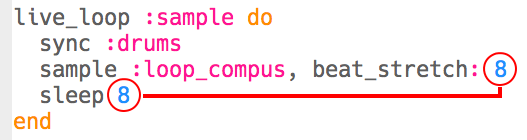

\--- challenge \---

## التحدي: تغيير العينة

هل يمكنك تغيير العينة المستخدمة؟

لمعرفة عينات الحلقة المتاحة ، يمكنك الانتقال إلى [ jumpto.cc/sonic-pi-samples ](http://jumpto.cc/sonic-pi-samples) أو فقط اكتب `sample :loop ` واختر من القائمة التي تظهر.

قد تحتاج أيضًا إلى تغيير الأرقام في التعليمات البرمجية لعينات مختلفة. يمكنك استخدام الكود التالي لمعرفة المدة الزمنية للعينة:

`puts sample_duration(:sample_name)`

لتكرار عينة بدون فراغ، **تأكد من أن كلا الرقمين متطابقان**.

\--- /challenge \---