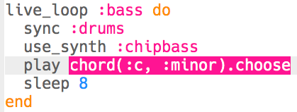
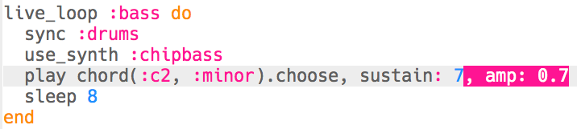

## إضافة صوت عميق

الآن دعونا نضيف بعض نوتات الصوت العميق إلى الموسيقى الخاصة بك.

+ ابدأ بإنشاء `live_loop` جديد يسمى `:bass`. هذه الحلقة الجديدة يجب أن تكون متزامنة` sync ` مع الطبول.
    
    

+ أضف كود للعب نوتة واحدة كل 8 نبضات. تستخدم النوتة التي تم تشغيلها التجميع `:chipbass`.
    
    

+ اضغط على "تشغيل Run" (لا حاجة لإيقاف الموسيقى وإعادة تشغيلها). يجب أن تسمع النوتة تشتغل كل 8 نبضات.
    
    

      <audio controls preload> <source src="resources/bass-single.mp3" type="audio/mpeg"> Your browser does not support the <code>audio</code> element. </audio>
    

+ إن **chord** هي مجموعة من النوتات يتم تشغيلها معا.
    
    

      <audio controls preload> <source src="resources/chord.mp3" type="audio/mpeg"> Your browser does not support the <code>audio</code> element. </audio>
    

    بدلاً من تشغيل نفس النوتة كل 8 ايقاعات، يمكنك `الاختيار` نوتة عشوائية من **chord**. In this case, the chord is **C Minor**.
    
    

+ النغمة "وسط" C هو في الواقع `:c4`. لتشغيل نغمات أقل جهورا، أضف رقمًا أقل من 4 بعد اسم الوتر.
    
    

+ استخدم ` sustain ` لاختيار عدد الضربات التي تحملها النوتة.
    
    

+ يمكنك أيضًا استخدام `amp` لاختيار صوت القاعدة. عدد أقل من 1 سيكون أكثر هدوءاً، و أعلى من 1 سيكون أعلى.
    
    

+ يمكنك أيضا إضافة عينة (أعلى) للعب في بداية كل نوتة.
    
    

+ Press 'Run' to test your code. ليس هناك حاجة لإيقاف الموسيقى الخاصة بك وإعادة تشغيلها.
    
    

      <audio controls preload> <source src="resources/bass.mp3" type="audio/mpeg"> Your browser does not support the <code>audio</code> element. </audio>
    
