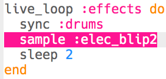

## إضافة تأثيرات صوتية

أخيرًا ، دعنا نضيف بعض المؤثرات الصوتية إلى الموسيقى الخاصة بك.

+ أضف `live_loop` آخر بالاسم `:effects`، الذي `يتزامن` مع الطبول.
    
    

+ أضف هذه التعليمة البرمجية لتشغيل العينة `:elec_blip2` كل دقتين.
    
    

+ انقر فوق تشغيل "Run" لاختبار الكود الخاص بك (ليست هناك حاجة لإيقاف الموسيقى وإعادة تشغيلها). يجب أن تسمع صوت كل دقتين.
    
    

      <audio controls preload> <source src="resources/noises.mp3" type="audio/mpeg"> المتصفح الخاص بك لا يدعم عنصر <code>الصوت </code>. </audio>
    

+ بدلاً من أن تلعب نفس التأثير في كل مرة، يمكنك بدلاً من ذلك أن تختار عشوائياً من قائمة فيها مؤثرين.
    
    

+ انقر فوق تشغيل "Run" لاختبار الكود الخاص بك (ليست هناك حاجة لإيقاف الموسيقى وإعادة تشغيلها).