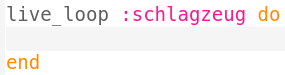
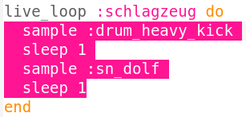
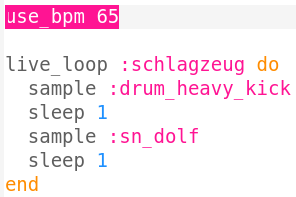

## Schlagzeug

Lass uns anfangen, indem wir einen einfachen Drum-Loop erstellen.

+ Erstelle zuerst einen `live_loop` mit dem Namen `:schlagzeug`.
    
    
    
    Alles dass zu einem `live_loop` hinzugefügt wird, wird wiederholt, bis "Stop" gedrückt wird.

+ Füge eine grosse und kleine Trommel hinzu, die abwechselnd jeweils einen Beat spielen.
    
    

+ Klicke das mit 'Run' beschriftete Wiedergabebutton, um deine Drum-Loops abzuspielen.
    
    

      <audio controls preload> <source src="resources/drums.mp3" type="audio/mpeg"> Ihr Browser unterstützt das <code>Audio-</code> Element nicht. </audio>
    

+ Wenn dir dein Drum-Loop zu schnell oder zu langsam ist, kannst du die Geschwindigkeit, gemessen in Beats pro Minute (bpm), ändern.
    
    
    
    Du musst die Wiedergabe deines `live_loop` anhalten und neu starten, um ihn zu beschleunigen oder zu verlangsamen.