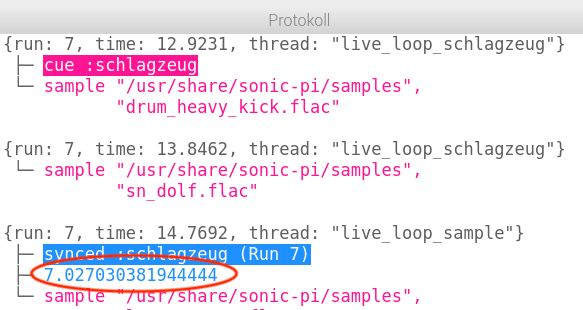

## Ein Sample hinzufügen

Jetzt legen wir eines neues, sich wiederholendes Sample über unseren Drum-Loop.

+ Um ein Sample zeitgleich mit deinem Drum-Loop abzuspielen, programmieren wir einen weiteren `live_loop` mit dem Namen `: Sample`.
    
    

+ Fügen das Sample `: loop_compus` ein, das alle 8 Beats abgespielt werden soll.
    
    

+ Wenn du dein Sample abspielst, merkst du, dass **nicht zu den Drums** passt!
    
    

      <audio controls preload> <source src="resources/beat-bug.mp3" type="audio/mpeg"> Ihr Browser unterstützt das <code>Audio-</code> Element nicht. </audio>
    

+ Als erstes musst du das Sample mit dem Drum-Loop abgleichen. Verwende dazu den `sync` Befehl.
    
    

+ Das hört sich aber immer noch nicht richtig an! Verwende diesen Befehl, um die Länge des Samples auszugben:
    
    

+ Wenn du jetzt im **Protokoll** suchst, wirst du sehen, dass das Sample zwar alle 8 Takte wiederholt wird, **aber nicht ganz 8 Takte**dauert.
    
    
    
    (Du kannst jetzt den Befehl zum Ausgeben der Länge des Samples wieder löschen.)

+ Um das Sample exakt mit dem Drum-Loop abzugleichen, musst du es etwas **verlängern**, damit es auch genau 8 Takte lang dauert.
    
    

+ Klicke auf das Wiedergabebutton um deiner Änderungen zu hören- **Du musst dazu die Musik nicht stoppen und erneut starten**! Du solltest jetzt hören, dass dein Sample zeitlich mit Ihrem Drum-Loop gespielt wird.
    
    

      <audio controls preload> <source src="resources/beat-fixed.mp3" type="audio/mpeg"> Ihr Browser unterstützt das <code>Audio-</code> Element nicht. </audio>
    
