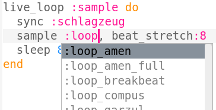
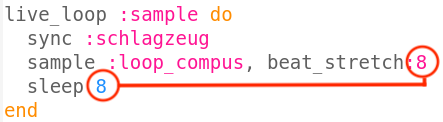

\--- challenge \---

## Herausforderung: Ändere das Sample

Kannst du ein anderes Sample verwenden?

Du kannst zu [jumpto.cc/sonic-pi-samples](http://jumpto.cc/sonic-pi-samples) gehen um die Samples in Sonic-Pi zu sehen oder einfach `sample: loop` eingeben und aus der angezeigten Liste auswählen.

Du musst vielleicht auch die Zahlen in deinem Programm für verschiedene Samples ändern. Mit dem folgenden Befehl kannst du die Länge eines Samples herausfinden:

`puts sample_duration(:name_des_samples)`

Damit ein Sample ohne Unterbrechnung wiederholt wird, **musst du sicherstellen, dass beide Zahlen übereinstimmen**.

-- /challenge --