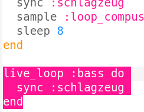
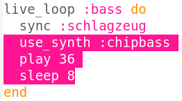
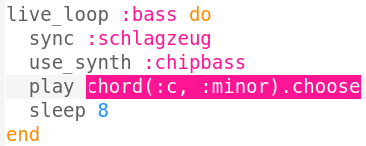
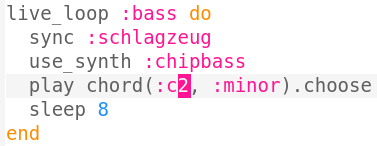
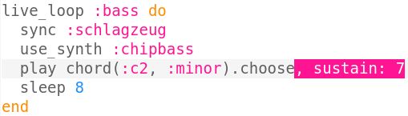
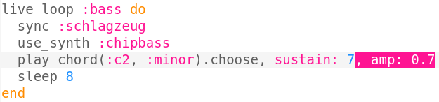
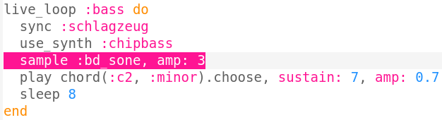

## Einen Bass hinzufügen

Jetzt fügen wir dem Musikstück einige Bassnoten hinzu.

+ Beginne mit einem neuen `live_loop` mit dem Namen `:bass`. Auch diese neue Schleife soll mit dem `sync`-Befehl mit dem Schlagzeug abgeglichen werden.
    
    

+ Erweitere das Programm so, dass alle 8 Takte eine einzelne Note gespielt wird. Die Note wird mit dem `:chipbass` Synthesizer gespielt.
    
    

+ Klicke das Wiedergabebutton (Du musst die Wiedergabe nicht erst beenden und erneut starten). Du solltest die Note alle 8 Takte hören.
    
    

      <audio controls preload> <source src="resources/bass-single.mp3" type="audio/mpeg"> Ihr Browser unterstützt das <code>Audio-</code> Element nicht. </audio>
    

+ Ein **Akkord** ist eine Gruppe von gemeinsam gespielten Noten.
    
    

      <audio controls preload> <source src="resources/chord.mp3" type="audio/mpeg"> Ihr Browser unterstützt das <code>Audio-</code> Element nicht. </audio>
    

    Statt die gleiche Note alle 8 Takte zu spielen, kannst du eine zufällige Note aus einem **Akkord** wählen. In diesem Fall aus dem **C Moll** Akkord.
    
    

+ Das "mittlere" C ist eigentlich `:c4`. Um tiefere Basstöne zu spielen, füge nach dem Akkordnamen eine Zahl hinzu die kleiner als 4 ist.
    
    

+ Mit dem Befehl `sustain` kannst du entscheiden für wie viele Takte die Note gehalten wird.
    
    

+ Du kannst auch den `amp`-Befehl nutzen, um die Lautstärke des Basses zu wählen. Eine Zahl kleiner als 1 ist leiser und eine Zahl größer als 1 ist lauter. Denke daran die Dezimalzahlen mit Punkt statt Komma zu schreiben.
    
    

+ Du kannst auch ein (lauteres) Sample hinzufügen, das am Anfang jeder Note gespielt wird.
    
    

+ Klicke auf das Wiedergabebutton, um die Änderungen zu hören. Du musst die Wiedergabe dazu nicht erst beenden und erneut starten.
    
    

      <audio controls preload> <source src="resources/bass.mp3" type="audio/mpeg"> Ihr Browser unterstützt das <code>Audio-</code> Element nicht. </audio>
    
