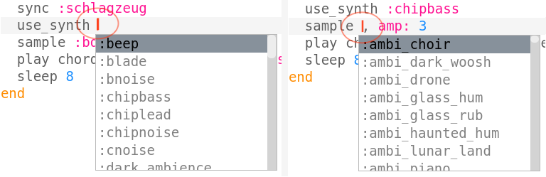

\--- challenge \---

## Herausforderung: Bass wechseln

Können Sie die Basstöne Ihrer Musik ändern? Sie könnten sich ändern:

+ Der Name des gespielten Akkords, z. B. `f2` statt `c2`
+ Der Akkordtyp, zB `: Dur` statt `: Moll`
+ Der verwendete Synth
+ Das Beispiel wurde abgespielt

\--- /challenge \---