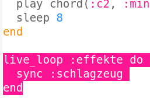
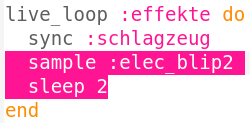
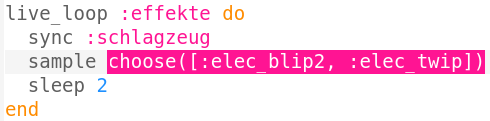

## Soundeffekte hinzufügen

Zum Schluss fügen wir deiner Musik einige Soundeffekte hinzu.

+ Erstelle einen weiteren `live_loop` mit dem Namen `:effekte`, der auch mit `sync` mit dem Schlagzeug abgeglichen wird.
    
    

+ Füge die gezeigten Befehl ein, um ein `:elec_blip2` Sample alle 2 Takte abzuspielen.
    
    

+ Klicke auf das Wiedergabebutton, um die Änderungen zu hören (du musst die Wiedergabe dazu nicht erst beenden und erneut starten). Du solltest alle 2 Takte einen Piepton hören.
    
    

      <audio controls preload> <source src="resources/noises.mp3" type="audio/mpeg"> Ihr Browser unterstützt das <code>Audio-</code> Element nicht. </audio>
    

+ Anstatt jedes Mal denselben Effekt zu spielen, könntest du aus einer Liste von 2 Effekten zufällig einen auswählen.
    
    

+ Klicke auf das Wiedergabebutton, um deine zufälligen Effekte zu hören (du musst die Wiedergabe dazu nicht erst anhalten und wieder neu starten).