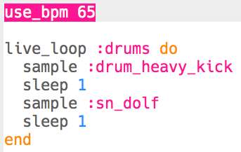

## Τύμπανα

Ας ξεκινήσουμε δημιουργώντας έναν απλό βρόχο τύμπανου.

+ Ξεκίνα δημιουργώντας ένα `live_loop` με όνομα `:drums`.
    
    
    
    Οποιονδήποτε κώδικα προσθέσεις σε ένα `live_loop` θα επαναληφθεί μέχρι να πατήσεις το «Stop».

+ Πρόσθεσε ένα τύμπανο και ένα ταμπούρο εναλλάξ, που να παίζουν το καθένα για ένα ρυθμό.
    
    

+ Πάτησε «Run» για να ελέγξεις το βρόχο του τύμπανου.
    
    

      <audio controls preload> <source src="resources/drums.mp3" type="audio/mpeg"> Το πρόγραμμα περιήγησής σου δεν υποστηρίζει αυτό το <code>ηχητικό</code> στοιχείο. </audio>
    

+ Εάν ο βρόχος του τύμπανού σου είναι πολύ γρήγορος/αργός, μπορείς να αλλάξεις τα χτυπήματα ανά λεπτό (bpm).
    
    
    
    Θα πρέπει να σταματήσεις και να ξεκινήσεις το `live_loop` για να το επιταχύνεις ή να το επιβραδύνεις.