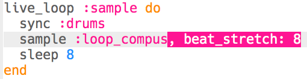

## Προσθήκη δείγματος

Ας προσθέσουμε ένα επαναλαμβανόμενο δείγμα πάνω από τη βασική επανάληψη του τύμπανου.

+ Για να αναπαράγεις ένα δείγμα εγκαίρως με τα τύμπανά σου, δημιούργησε ένα άλλο `live_loop` με όνομα `:sample`.
    
    

+ Πρόσθεσε το δείγμα `:loop_compus`, κάνοντάς το να αναπαράγεται μετά από κάθε 8 χτυπήματα.
    
    

+ Εάν δοκιμάζεις το δείγμα σου, θα παρατηρήσεις ότι **δεν ταιριάζει καθόλου με τα τύμπανα**!
    
    

    <audio controls preload> 
      <source src="resources/beat-bug.mp3" type="audio/mpeg"> Το πρόγραμμα περιήγησης σου δεν υποστηρίζει αυτό το <code>ηχητικό</code> στοιχείο. 
    </audio>
    

+ Το πρώτο πράγμα που πρέπει να κάνεις είναι ο συγχρονισμός (`sync`) του δείγματός σου με τον χτύπο του τυμπάνου.
    
    

+ Αυτό ακόμα δεν ακούγεται σωστό! Πρόσθεσε κώδικα για να εμφανίσεις τη διάρκεια του δείγματος:
    
    

+ Εάν μετακινηθείς προς τα πίσω στο αρχείο καταγραφής (**log**), θα δεις ότι,αν και το δείγμα επαναλαμβάνεται κάθε 8 χτύπους, **τ ο δείγμα δεν διαρκεί αρκετά για 8 χτύπους**.
    
    
    
    (Τώρα μπορείς να καταργήσεις τον κώδικα για να εμφανίζεις τη διάρκεια του δείγματος.)

+ Για να ταιριάξει το δείγμα σου με τα τύμπανα, θα πρέπει να «τεντώσεις» (**stretch**) το δείγμα έτσι ώστε να διαρκεί επίσης ακριβώς 8 χτύπους.
    
    

+ Δοκίμασε τον κώδικά σου πατώντας ξανά «Run» - **δεν χρειάζεται να σταματήσεις και να επανεκκινήσεις τη μουσική**! Τώρα πρέπει να ακούσεις ότι το δείγμα σου αναπαράγεται με το ρυθμό του ντραμς.
    
    

    <audio controls preload> 
      <source src="resources/beat-fixed.mp3" type="audio/mpeg"> Το πρόγραμμα περιήγησής σου δεν υποστηρίζει αυτό το <code>ηχητικό</code> στοιχείο. 
    </audio>
    
