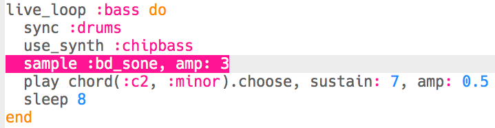

## Προσθήκη μπάσου

Τώρα πρόσθεσε μερικές νότες μπάσου στη μουσική σου.

+ Ξεκίνα δημιουργώντας ένα `live_loop` με όνομα `:bass`. Αυτός ο νέος βρόχος θα πρέπει επίσης να συγχρονίζεται (`sync`) με τα ντραμς.
    
    

+ Πρόσθεσε κώδικα για να παίξεις μια νότα κάθε 8 χτυπήματα. Η νότα που παίζεται χρησιμοποιεί το συνθεσάιζερ `:chipbass`.
    
    

+ Πάτησε «Run» (δεν χρειάζεται να σταματήσεις και να επανεκκινήσεις τη μουσική σου). Θα πρέπει να ακούς μια νότα κάθε 8 χτυπήματα.
    
    

      <audio controls preload> <source src="resources/bass-single.mp3" type="audio/mpeg"> Το πρόγραμμα περιήγησής σου δεν υποστηρίζει αυτό το <code>ηχητικό</code> στοιχείο. </audio>
    

+ Μια συγχορδία (**chord**) είναι μια ομάδα από νότες που παίζονται μαζί.
    
    

      <audio controls preload> <source src="resources/chord.mp3" type="audio/mpeg"> Το πρόγραμμα περιήγησής σου δεν υποστηρίζει αυτό το <code>ηχητικό</code> στοιχείο. </audio>
    

    Αντί να αναπαράγεις την ίδια νότα κάθε 8 χτυπήματα, μπορείς να `επιλέξεις` μια τυχαία νότα από μια συγχορδία (**chord**). Σε αυτήν την περίπτωση, η συγχορδία είναι **C Minor**.
    
    

+ Η «Middle» C είναι στην πραγματικότητα η `:c4`. Για να αναπαράγεις χαμηλότερες νότες μπάσου, πρόσθεσε έναν αριθμό μικρότερο από 4 μετά το όνομα της συγχορδίας.
    
    

+ Χρησιμοποίησε την εντολή `sustain` για να επιλέξεις για πόσα χτυπήματα διατηρείται η νότα.
    
    

+ Μπορείς επίσης να χρησιμοποιήσεις την εντολή `amp` για να επιλέξεις την ένταση του μπάσου. Ένας αριθμός μικρότερος από 1 θα έχει πιο χαμηλή ένταση, ενώ υψηλότερος από 1 θα έχει πιο υψηλή ένταση.
    
    

+ Μπορείς επίσης να προσθέσεις ένα (δυνατότερο) δείγμα για αναπαραγωγή στην αρχή κάθε νότας.
    
    

+ Πάτησε «Run» για να ελέγξεις τον κώδικά σου. Δεν χρειάζεται να σταματήσεις και να επανεκκινήσεις τη μουσική σου.
    
    

      <audio controls preload> <source src="resources/bass.mp3" type="audio/mpeg"> Το πρόγραμμα περιήγησής σου δεν υποστηρίζει αυτό το <code>ηχητικό</code> στοιχείο. </audio>
    
