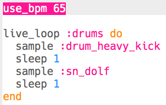

## Drums
Let's start by creating a simple drum loop.

+ Start by creating a `live_loop` called `:drums`.

    

    Any code added to a `live_loop` will repeat until 'Stop' is pressed.

+ Add an alternating drum and snare, that play for one beat each.

    

+ Press 'Run' to test your drum loop.

    

    <audio controls preload>
      <source src="sounds/drums.mp3" type="audio/mpeg">
    Your browser does not support the <code>audio</code> element.
    </audio>
    

+ If your drum loop is too fast/slow, you can change the beats per minute (bpm).

    

    You'll need to stop and start your `live_loop` to speed it up or slow it down.

### Additional information for club leaders

If you need to print this project, please use the [Printer friendly version](./print).

--- collapse ---
---
title: Club leader notes
---

## Introduction:
In this project, children will learn how to use `live_loop` to make multiple pieces of music play in time with each other. They will also learn that loops can be edited and synchronised without having to stop and restart the music.

## Resources
The 'Project Materials' link for this project contains the following resources:

##### Club leader Resources

You can find a completed version of this project by clicking the 'Project Materials' link for this project, which contains:

+ live-dj.txt
+ live-dj.mp3

## Learning Objectives
+ Sonic Pi 'Live Loop'
+ Playing random notes and samples

This project covers elements from the following strands of the [Raspberry Pi Digital Making Curriculum](http://rpf.io/curriculum):

+ [Combine programming constructs to solve a problem.](https://www.raspberrypi.org/curriculum/programming/builder)

## Challenges
+ "Changing the drums" - editing the drum samples used;
+ "Changing the sample" - editing the sample used;
+ "Changing the bass" - editing the notes played;
+ "Changing the effects" - editing the effects used.

## Frequently Asked Questions
+ To find samples available in Sonic Pi, learners can go to <a href="http://jumpto.cc/sonic-pi-samples">jumpto.cc/sonic-pi-samples</a>. Alternatively, they can just type `sample [space]` and choose from the list that appears.

--- /collapse ---

--- collapse ---
---
title: Project materials
---

## Club leader resources
* [Downloadable completed Sonic Pi project](resources/live-dj.txt)
* [Downloadable completed project mp3 file](resources/live-dj.mp3)

--- /collapse ---