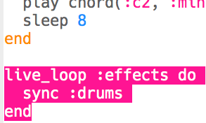

## Adding sound effects
Finally, let's add some sound effects to your music.

+ Add another `live_loop` called `:effects`, which `sync`s with the drums.

    

+ Add this code to play the `:elec_blip2` sample every 2 beats.

    

+ Click 'Run' to test your code (there's no need to stop and restart your music). You should hear a beep effect every 2 beats.

    

    <audio controls preload>
      <source src="resources/noises.mp3" type="audio/mpeg">
    Your browser does not support the <code>audio</code> element.
    </audio>
    

+ Instead of playing the same effect each time, you could instead choose randomly from a list of 2 effects.

    

+ Click 'Run' to test your random effects (there's no need to stop and restart your music).

