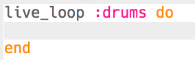

## Batería

Empecemos por crear una secuencia de batería.

+ Empieza creando un nuevo `live_loop` llamado `:drums`.
    
    
    
    Cualquier código agregado a un ` live_loop ` se repetirá hasta que se presione 'Stop'.

+ Añade una nota de tambor y una de tarola que suenen de manera alternada, una por cada tiempo.
    
    

+ Presiona 'Ejecutar' para probar tu secuencia de batería.
    
    

      <audio controls preload> <source src="resources/drums.mp3" type="audio/mpeg"> Tu navegador no es compatible con el elemento <code>audio</code>. </audio>
    

+ Si tu secuencia de batería es demasiado rápida o lenta, puedes cambiar la cantidad de tiempos por minuto, bpm en inglés.
    
    
    
    Deberás reiniciar tu `secuencia` para acelerarla o ralentizarla.