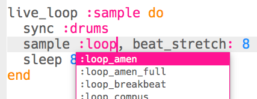

\--- challenge \---

## Desafío: Cambia la muestra

¿Puedes cambiar la muestra utilizada?

Para ver qué bucles están disponibles, puedes ir a [jumpto.cc/sonic-pi-samples](http://jumpto.cc/sonic-pi-samples), o simplemente escribe `sample :loop` y elige uno de la lista que aparece.

Tal vez tengas que cambiar los números en tu código para diferentes muestras. Puedes utilizar el siguiente código para averiguar la duración de una muestra:

`puts sample_duration(:nombre_de_la_muestra)`

Para que una muestra se repita sin ningún vacío, **asegúrate de que ambos números coincidan**.

\--- /challenge \---