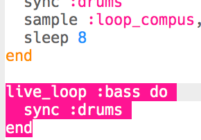

## Añade un bajo

Ahora vamos a añadir algunas notas de bajo a tu música.

+ Empieza creando un nuevo `live_loop` llamado `:bass`. Este nuevo bucle también debería estar `sincronizado` con la batería.
    
    

+ Añade código para que suene una nota cada 8 tiempos. La nota reproducida utiliza el sintetizador `:chipbass`.
    
    

+ Presiona 'Ejecutar' (no es necesario parar y reiniciar la música). Debería escuchar una nota cada 8 tiempos.
    
    

    <audio controls preload> 
      <source src="resources/bass-single.mp3" type="audio/mpeg"> Tu navegador no es compatible con el elemento <code>audio</code>. 
    </audio>
    

+ Un **acorde** es un grupo de notas tocadas juntas.
    
    

    <audio controls preload> 
      <source src="resources/chord.mp3" type="audio/mpeg"> Tu navegador no es compatible con el elemento <code>audio</code>. 
    </audio>
    

    En vez de tocar la misma nota cada 8 tiempos, puedes `elegir` una nota aleatoria de un **acorde**. En este caso, el acorde es **C menor**.
    
    

+ 'Middle' C es en realidad `: c4`. Para tocar notas de bajo más bajas, agrega un número menor que 4 después del nombre del acorde.
    
    

+ Usa `sustain` para escoger por cuántos tiempos se sostendrá la nota.
    
    

+ También puedes usar `amp` para elegir la fuerza del bajo. Un número menor que 1 será más silencioso y más alto que 1 será más ruidoso.
    
    

+ También puedes añadir una muestra (más alta) para reproducirla al inicio de cada nota.
    
    

+ Presiona 'Ejecutar' para probar tu código. No hay necesidad de detener y reiniciar tu música.
    
    

    <audio controls preload> 
      <source src="resources/bass.mp3" type="audio/mpeg"> Tu navegador no es compatible con el elemento <code>audio</code>. 
    </audio>
    
