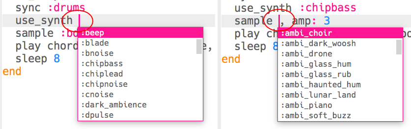

\--- challenge \---

## Desafío: Cambia el bajo

¿Puedes cambiar las notas de bajo en tu música? Puedes cambiar:

+ El nombre del acorde tocado, ejemplo: `f2` en vez de `c2`
+ El tipo de acorde, ejemplo: `:major` en lugar de `:minor`
+ El sintetizador usado
+ La muestra reproducida

\--- /challenge \---