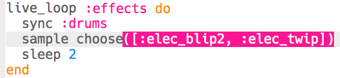

## Añade efectos de sonido

Finalmente, agreguemos algunos efectos de sonido a tu música.

+ Añade otro `live_loop` llamado `:effects`, que esté sincronizado con los tambores utilizando `sync`.
    
    

+ Añade este código para reproducir la muestra `:elec_blip2` cada 2 tiempos.
    
    

+ Haz clic en 'Ejecutar' para probar tu código (no hay necesidad de parar y reiniciar tu música). Deberías escuchar un pitido cada 2 tiempos.
    
    

      <audio controls preload> <source src="resources/noises.mp3" type="audio/mpeg"> Tu navegador no es compatible con el elemento <code>audio</code>. </audio>
    

+ En lugar de reproducir el mismo efecto cada vez, puedes elegir aleatoriamente uno de una lista de 2 efectos.
    
    

+ Haz clic en 'Ejecutar' para probar tus efectos (no hay necesidad de parar y reiniciar tu música).