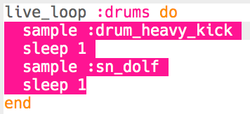

## Drums

Let's start by creating a simple drum loop.

+ Start by creating a `live_loop` called `:drums`.
    
    
    
    Any code added to a `live_loop` will repeat until 'Stop' is pressed.

+ Add an alternating drum and snare, that play for one beat each.
    
    

+ Press 'Run' to test your drum loop.
    
    

      <audio controls preload> <source src="resources/drums.mp3" type="audio/mpeg"> Your browser does not support the <code>audio</code> element. </audio>
    

+ If your drum loop is too fast/slow, you can change the beats per minute (bpm).
    
    
    
    You'll need to stop and start your `live_loop` to speed it up or slow it down.