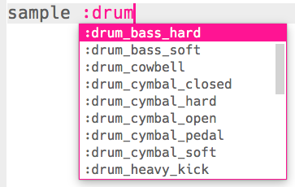

--- challenge ---

## चुनौती: ड्रम लूप को बदलना

क्या आप अपने ड्रम लूप में विभिन्न नमूनों का उपयोग कर सकते हैं?

यह देखने के लिए कि कौन से नमूने उपलब्ध हैं, आप [jumpto.cc/sonic-pi-samples](http://jumpto.cc/sonic-pi-samples) पर जा सकते हैं, या बस टाइप करें `sample :drum` और दिखाई देने वाली सूची में से चुनें।

--- /challenge ---