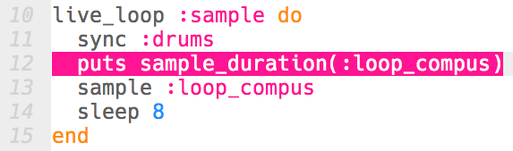

## एक नमूना जोड़ना

आइए मूल ड्रम लूप पर लूपिंग का नमूना जोड़ें।

+ अपने ड्रमों के साथ उसी समय पर कोई नमूना चलाने के लिए, `:sample` नामक दूसरा `live_loop` बनाएँ।
    
    

+ नमूना `:loop_compus` जोड़ें, ताकि यह हर 8 बीट पर चले।
    
    

+ यदि आप अपने नमूने का परीक्षण करते हैं, तो आप देखेंगे कि यह **ड्रम से बिल्कुल मेल नहीं खाता** है!
    
    

      <audio controls preload> <source src="resources/beat-bug.mp3" type="audio/mpeg"> आपका ब्राउज़र <code>audio</code> तत्व का समर्थन नहीं करता है। </audio>
    

+ आपको जो पहली चीज़ करनी होगी वह है अपने नमूने को ड्रम बीट के साथ `sync` करना।
    
    

+ इसकी आवाज़ अभी भी सही नहीं है! नमूने की अवधि को प्रिंट करने के लिए कोड जोड़ें:
    
    

+ यदि आप **लॉग** के माध्यम से वापस स्क्रॉल करते हैं, तो आप देखेंगे कि हालांकि नमूना हर 8 बीट के बाद दोहरा रहा है, **फिर भी नमूना पूरे 8 बीट तक नहीं चलता है**।
    
    
    
    (अब आप नमूने की अवधि को प्रिंट करने के लिए कोड निकाल सकते हैं।)

+ अपने नमूने का ड्रम के साथ मेल बैठाने के लिए आपको नमूने को **बड़ा** करने की आवश्यकता होगी ताकि यह पूरी तरह से 8 बीट भी चले।
    
    

+ 'चलाएँ' को फिर से दबाकर अपने कोड का परीक्षण करें -- **आपको संगीत को रोकने और फिर से शुरू करने की आवश्यकता नहीं है**! अब आपको आपका नमूना आपके ड्रम बीट के साथ समय पर चलता हुआ सुनाई देना चाहिए।
    
    

      <audio controls preload> <source src="resources/beat-fixed.mp3" type="audio/mpeg"> आपका ब्राउज़र <code>audio</code> तत्व का समर्थन नहीं करता है। </audio>
    
