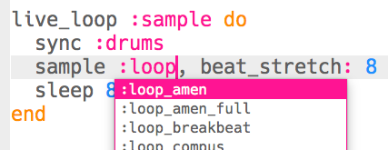
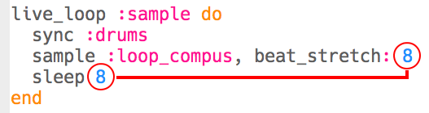

--- challenge ---

## चुनौती: नमूने को बदलना

क्या आप उपयोग में लाए गए नमूने को बदल सकते हैं?

यह देखने के लिए कि लूप के कौन से नमूने उपलब्ध हैं, आप [jumpto.cc/sonic-pi-samples](http://jumpto.cc/sonic-pi-samples) पर जा सकते हैं, या बस टाइप करें `sample :loop` और दिखाई देने वाली सूची में से चुनें।

आपको अलग-अलग नमूनों के लिए अपने कोड में संख्याओं को भी बदलना पड़ सकता है। किसी अवधि का नमूना ढूँढने के लिए आप निम्नलिखित कोड का उपयोग कर सकते हैं:

`puts sample_duration(:sample_name)`

नमूने को किसी अंतराल के बिना लूप करने के लिए, **सुनिश्चित करें कि दोनों संख्याओं का मिलान होता है**।

--- /challenge ---