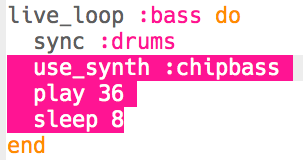

## बास जोड़ना

आइए अब हम आपके संगीत में कुछ बास स्वर जोड़ें।

+ `:bass` नामक एक नया `live_loop` बनाकर शुरू करें। इस नए लूप को ड्रम के साथ `sync` भी होना चाहिए।
    
    

+ किसी अकेले स्वर को हर 8 बीट पर चलाने के लिए कोड जोड़ें। चलाए गए स्वर में `:chipbass` सिंथसाइज़र का उपयोग होता है।
    
    

+ 'Run' (चलाएँ) दबाएँ (अपने संगीत को रोकने और फिर से शुरू करने की आवश्यकता नहीं है)। आपको हर 8 बीट पर एक स्वर चलता हुआ सुनाई देना चाहिए।
    

<audio controls preload> 
  <source src="resources/bass-single.mp3" type="audio/mpeg"> 
आपका ब्राउज़र <code>audio</code> तत्व का समर्थन नहीं करता है। 
</audio>

+ **chord** (स्वर तंत्री) इकट्ठे चलाए गए स्वरों का एक समूह होता है।
    

<audio controls preload> 
  <source src="resources/chord.mp3" type="audio/mpeg"> 
आपका ब्राउज़र <code>audio</code> तत्व का समर्थन नहीं करता है। 
</audio>

एक ही स्वर को हर 8 बीट पर चलाने के बजाय, आप एक **chord** से कोई यादृच्छिक स्वर `choose` (चयन) कर सकते हैं। इस मामले में, chord (स्वर संघात) **C Minor** है।
    
    

+ 'बीच वाला' C वास्तव में `:c4` है। निम्न बास स्वर चलाने के लिए, स्वर संघात के नाम के बाद 4 से कम की कोई संख्या जोड़ें।
    
    

+ यह चुनने के लिए कि नोट कितने बीट के लिए रखा गया है एक `sustain` का उपयोग करें।
    
    

+ आप बास की आवाज़ की तेज़ी का चयन करने के लिए `amp` का उपयोग भी कर सकते हैं। संख्या 1 से कम होने पर आवाज़ धीमी होगी, और 1 से अधिक होने पर तेज़ होगी।
    
    

+ प्रत्येक स्वर के आरंभ में आप चलाए जाने के लिए एक (तेज़ आवाज़ का) नमूना भी जोड़ सकते हैं।
    
    

+ अपने कोड का परीक्षण करने के लिए 'Run' (चलाएँ) दबाएँ। अपने संगीत को रोकने और फिर से शुरू करने की आवश्यकता नहीं है।
    

<audio controls preload>
  <source src="resources/bass.mp3" type="audio/mpeg"> 
आपका ब्राउज़र <code>audio</code> तत्व का समर्थन नहीं करता है। 
</audio>

