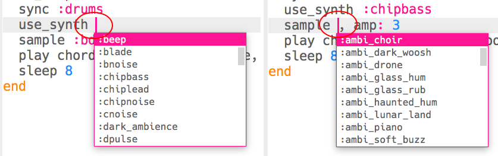

\--- challenge \---

## चुनौती: बास को बदलना

क्या आप अपने संगीत में बास स्वरों को बदल सकते हैं। आप बदल सकते हैं:

+ बजाई गई तंत्री का नाम, उदाहरण के लिए `c2` के बजाय `f2`
+ तंत्री का प्रकार, उदाहरण के लिए `:minor` के बजाय `:major`
+ इस्तेमाल किया गया सिंथसाइज़र
+ बजाया गया नमूना

\--- /challenge \---