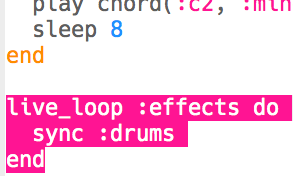
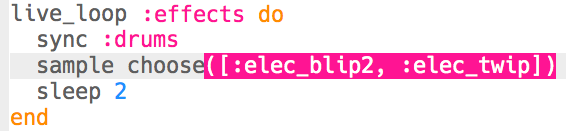

## ध्वनि प्रभाव जोड़ना

अंत में, आइए हम आपके संगीत में कुछ ध्वनि प्रभाव जोड़ें।

+ `:effects` नामक एक और `live_loop` जोड़ें, जो ड्रम के साथ `sync` करता है।
    
    

+ `:elec_blip2` नमूने को हर दो बीट पर चलाने के लिए इस कोड को जोड़ें।
    
    

+ अपने कोड का परीक्षण करने के लिए 'Run' (चलाएँ) पर क्लिक करें (अपने संगीत को रोकने और फिर से शुरू करने की आवश्यकता नहीं है)। आपको हर 2 बीट पर बीप का प्रभाव सुनाई देना चाहिए।
    

<audio controls preload> 
  <source src="resources/noises.mp3" type="audio/mpeg"> 
आपका ब्राउज़र <code>audio</code> तत्व का समर्थन नहीं करता है। 
</audio>

+ हर बार एक ही प्रभाव को चलाने के बजाय, आप 2 प्रभावों की सूची में से यादृच्छिक रूप से चयन कर सकते हैं।
    
    

+ अपने यादृच्छिक प्रभावों का परीक्षण करने के लिए 'Run' (चलाएँ) पर क्लिक करें (अपने संगीत को रोकने और फिर से शुरू करने की आवश्यकता नहीं है)।
