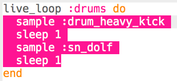

## Drums

Laten we beginnen met het creëren van een eenvoudige drum loop.

+ Begin met het maken van een `live_loop` genaamd `: drums`.
    
    
    
    Elke code die is toegevoegd aan een `live_loop` zal worden herhaald totdat op 'Stop' wordt gedrukt.

+ Voeg een afwisselend drum en snare toe, die elk één beat spelen.
    
    

+ Druk op 'Run' om je drumloop te testen.
    
    

      <audio controls preload> <source src="resources/drums.mp3" type="audio/mpeg"> Je browser ondersteunt het element <code>audio</code> niet. </audio>
    

+ Als je drum loop te snel/langzaam is, kun je de beats per minute (bpm) wijzigen.
    
    
    
    Je moet je `live_loop` stoppen en starten om het te versnellen of te vertragen.