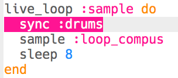
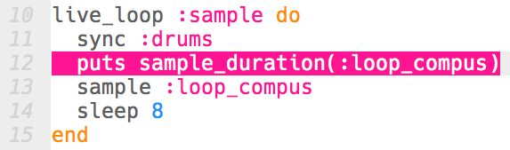

## Een sample toevoegen

Laten we een looping sample over de standaard drum loop toevoegen.

+ Om een ​​sample op tijd met je drums te spelen, maak je nog een `live_loop` genaamd `:sample`.
    
    

+ Voeg de sample `:loop_compus` toe, waardoor het elke 8 beats wordt afgespeeld.
    
    

+ Als je je sample test, merk je dat het helemaal **niet overeenkomt met de drums**!
    
    

      <audio controls preload> <source src="resources/beat-bug.mp3" type="audio/mpeg"> Je browser ondersteunt het element <code>audio</code> niet. </audio>
    

+ Het eerste wat je moet doen is je sample met de drum beat synchroniseren met behulp van `sync`.
    
    

+ Dit klinkt nog steeds niet goed! Voeg code toe om de duur van de sample weer te geven:
    
    

+ Als je terug door het **log** (logboek) bladert, zie je dat hoewel het sample elke 8 beats herhaalt, **het sample niet helemaal 8 beats duurt**.
    
    
    
    (Je kunt nu de code verwijderen om de sample duur weer te geven.)

+ Om je sample overeen te laten komen met de drums moet je de sample uitrekken **stretch** zodat het ook precies 8 beats duurt.
    
    

+ Test je code door nogmaals op 'Run' te drukken - **je hoeft niet te stoppen en de muziek opnieuw te starten**! Je zou nu moeten horen dat je sample gelijk speelt met je drum beat.
    
    

      <audio controls preload> <source src="resources/beat-fixed.mp3" type="audio/mpeg"> Je browser ondersteunt het element <code>audio</code> niet. </audio>
    
