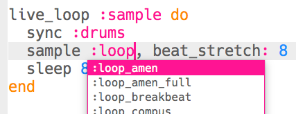

\--- challenge \---

## Uitdaging: de sample veranderen

Kun je de gebruikte sample veranderen?

Om te zien welke loop-samples beschikbaar zijn, kun je naar [jumpto.cc/sonic-pi-samples](http://jumpto.cc/sonic-pi-samples) gaan, of typ je gewoon `sample: loop` en kies uit de lijst die verschijnt.

Mogelijk moet je ook de getallen in je code wijzigen voor verschillende samples. Je kunt de volgende code gebruiken om de duur van een sample te achterhalen:

`puts sample_duration(:sample_naam)`

Om een sample te herhalen zonder pauze, **zorg je ervoor dat beide getallen overeenkomen**.

\--- /challenge \---