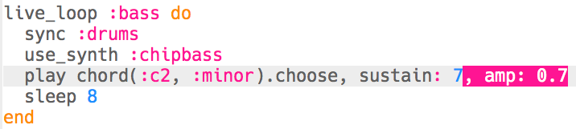

## Bas toevoegen

Laten we nu wat bas noten toevoegen aan je muziek.

+ Begin met het maken van een nieuwe `live_loop` genaamd `:bas`. Deze nieuwe lus moet ook `sync` (overeenkomen) met de drums.
    
    

+ Voeg code toe om elke acht beats een enkele noot te spelen. De gespeelde noot gebruikt de `:chipbass` synth.
    
    

+ Druk op 'Run' (je hoeft niet te stoppen en je muziek opnieuw te starten). Je zou elke 8 beats een noot moeten horen spelen.
    
    

      <audio controls preload> <source src="resources/bass-single.mp3" type="audio/mpeg"> Je browser ondersteunt het element <code>audio</code> niet. </audio>
    

+ Een **chord** (akkoord) is een groep noten die samen worden gespeeld.
    
    

      <audio controls preload> <source src="resources/chord.mp3" type="audio/mpeg"> Je browser ondersteunt het element <code>audio</code> niet. </audio>
    

    In plaats van het spelen van dezelfde noot om de 8 beats, kun je ook `kiezen` voor een willekeurige noot van een **akkoord**. In dit geval is het akkoord **C Minor**.
    
    

+ 'Midden' C is eigenlijk `: c4`. Om lagere bas noten te spelen, voeg je een nummer lager dan 4 toe na de akkoordnaam.
    
    

+ Gebruik een `sustain` om te kiezen voor hoeveel tellen de noot wordt aangehouden.
    
    

+ Je kunt ook `amp` gebruiken om het volume van de bas te kiezen. Een getal lager dan 1 wordt rustiger en hoger dan 1 wordt luider.
    
    

+ Je kunt ook een (luider) sample toevoegen om aan het begin van elke noot te spelen.
    
    

+ Druk op 'Run' om je code te testen. Het is niet nodig om je muziek te stoppen en opnieuw te starten.
    
    

      <audio controls preload> <source src="resources/bass.mp3" type="audio/mpeg"> Je browser ondersteunt het element <code>audio</code> niet. </audio>
    
