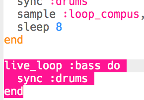
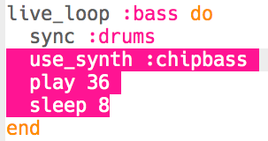
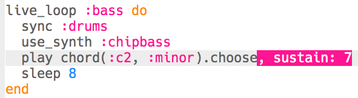
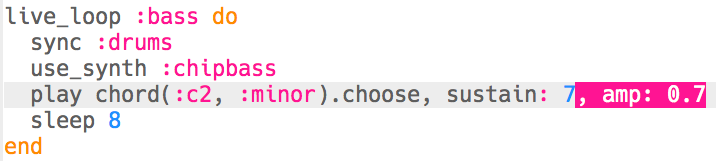

## Adding bass

Now let's add some bass notes to your music.

+ Start by creating a new `live_loop` called `:bass`. This new loop should also `sync` with the drums.
    
    

+ Add code to play a single note every 8 beats. The note played uses the `:chipbass` synth.
    
    

+ Press 'Run' (no need to stop and restart your music). You should hear a note play every 8 beats.
    
    

      <audio controls preload> <source src="resources/bass-single.mp3" type="audio/mpeg"> Your browser does not support the <code>audio</code> element. </audio>
    

+ A **chord** is a group of notes played together.
    
    

      <audio controls preload> <source src="resources/chord.mp3" type="audio/mpeg"> Your browser does not support the <code>audio</code> element. </audio>
    

    Instead of playing the same note every 8 beats, you can `choose` a random note from a **chord**. In this case, the chord is **C Minor**.
    
    

+ 'Middle' C is actually `:c4`. To play lower bass notes, add a number lower than 4 after the chord name.
    
    

+ Use a `sustain` to choose how many beats the note is held for.
    
    

+ You can also use `amp` to choose the loudness of the bass. A number lower than 1 will be quieter, and higher than 1 will be louder.
    
    

+ You can also add a (louder) sample to play at the start of each note.
    
    

+ Press 'Run' to test your code. There's no need to stop and restart your music.
    
    

      <audio controls preload> <source src="resources/bass.mp3" type="audio/mpeg"> Your browser does not support the <code>audio</code> element. </audio>
    
