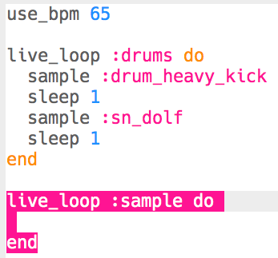

## Adding a sample

Let's add a looping sample over the basic drum loop.

+ To play a sample in time with your drums, create another `live_loop` called `:sample`.
    
    

+ Add the sample `:loop_compus`, making it play every 8 beats.
    
    

+ If you test your sample, you'll notice that it **doesn't match the drums** at all!
    
    

      <audio controls preload> <source src="resources/beat-bug.mp3" type="audio/mpeg"> Your browser does not support the <code>audio</code> element. </audio>
    

+ The first thing you'll need to do is `sync` your sample with the drum beat.
    
    

+ This still doesn't sound right! Add code to print the duration of the sample:
    
    

+ If you scroll back through the **log**, you'll see that although the sample is repeating every 8 beats, **the sample doesn't quite last 8 beats**.
    
    
    
    (You can now remove the code to print the sample duration.)

+ To match your sample with the drums you'll need to **stretch** the sample so that it lasts exactly 8 beats as well.
    
    

+ Test your code by pressing 'Run' again -- **you don't need to stop and restart the music**! You should now hear that your sample plays in time with your drum beat.
    
    

      <audio controls preload> <source src="resources/beat-fixed.mp3" type="audio/mpeg"> Your browser does not support the <code>audio</code> element. </audio>
    
